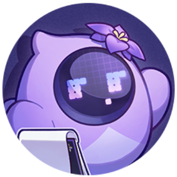
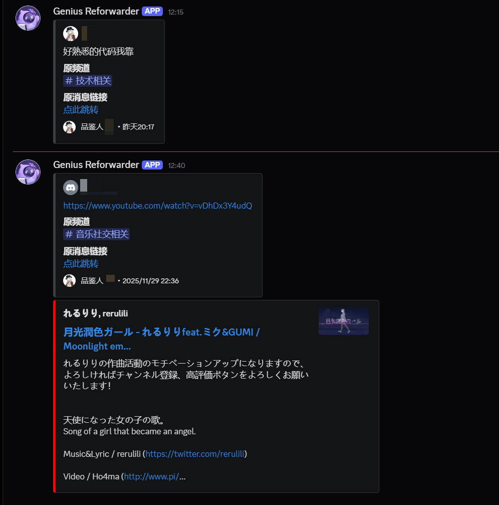

---

# Genius Forwarder Bot

当你在频道里看到「值得收藏 / 存档」的消息时，只要用指定的自定义表情点一下 reaction，这个 Bot 就会**自动把那条消息转发到指定频道**（比如 `#logs` / `#favorites`），并附上：

* 原作者
* 原频道
* 原消息链接（可点击跳回原消息）
* 原文内容
* 附件（图片 / 文件等）

同时，还会避免重复转发：
同一条消息如果已经有人点过指定表情，再点就不会再次转发。

---

## 功能特点

* **用表情做“收藏按钮”**
  在任意文本频道对一条消息加上指定的自定义表情（例如 `:Genius:`），Bot 自动转发到目标频道，方便其他高雅人士好好品鉴一番
  <br/>
  

* **只对“自己”的 reaction 生效**
  只有配置的那一个用户 ID（Bot 主人）点 reaction 时才会触发转发，别人乱点不会触发。

* **防止重复转发**
  如果这条消息上早就有这个表情（`Genius` 的计数 > 1），就直接跳过，避免刷屏。

* **保留链接预览**
  原消息里的 X/Twitter 链接等，会在转发后的消息中照样自动生成预览卡片（不被 embed 覆盖）。
  * 这个好难学的请你务必表扬我一下……

* **转发附件**
  原消息中如果有图片 / 文件，会被下载后重新发到目标频道。

* **附带元信息**
  转发消息中会包含：

  * 标记人（谁点的表情）
  * 原频道
  * 原作者
  * 原消息跳转链接

---

## 依赖

* Python 3.10+（推荐）
* [discord.py](https://github.com/Rapptz/discord.py) v2.x
* [python-dotenv](https://github.com/theskumar/python-dotenv)（从 `.env` 读取配置必须）

---

## 快速开始

### 1. 创建 Bot 并获取 Token

1. 打开 Discord Developer Portal → 新建应用 → 添加 Bot

2. 在 **Bot** 页面：

   * 打开：
     * `MESSAGE CONTENT INTENT`
     * `SERVER MEMBERS INTENT`
   * 复制 Bot Token（注意：**不要泄露**）

3. 在 **OAuth2 → URL Generator** 中：

   * Scopes 勾选：`bot`
   * Permissions 至少包含：

     * `View Channels`
     * `Send Messages`
     * `Read Message History`
     * `Embed Links`（可选）
     * `Attach Files`（可选）
   * 用生成的链接把 Bot 邀请进你的服务器

---

### 2. 项目配置

推荐使用 `.env` 文件存放私密配置。

在项目根目录创建 `.env`：

```env
DISCORD_TOKEN=你的BotToken
TARGET_CHANNEL_NAME=logs
TRIGGER_EMOJI_ID=1446321054057369620

```

* `DISCORD_TOKEN`：Bot 的 Token
* `TARGET_CHANNEL_NAME`：转发目标频道名字（如 `天才俱乐部`）
* `TRIGGER_EMOJI_ID`：触发用自定义表情的 ID

  * 在 Discord 里发送 `\:emoji:`
  * 会看到 `<:emoji:xxxxxxxxxxxxxx>` → 拿最后那串数字
* `MY_USER_ID`：你自己的用户 ID，可选
  * 开发者模式 → 右键你的名字 → 复制 ID

---

### 3. 运行

安装依赖：

```bash
pip install -U discord.py python-dotenv
```

运行：

```bash
python bot.py
```

终端出现类似：

```text
Logged in as EmojiForwarderBot (ID: xxxxxxxxxxxxxxxx)
------
```

说明连接成功。

## 🔐 安全注意事项

* **绝对不要** 把 Bot Token 写在代码里上传到公共仓库或发给别人。
* 如果不小心泄露 Token（哪怕只贴给 AI / 截图里带到了），务必：

  * 立刻在 Developer Portal → Bot → Reset Token
  * 更新 `.env` 中的 Token
* 建议将 `.env` 或 `config.py` 加入 `.gitignore`，只提交无敏感信息的代码。

---
## 📝 TODO / 可扩展点

* 支持「多种表情 → 不同分类频道」的规则
  （例如 `:eat:` → `#logs`，`:star:` → `#favorites`）
* 增加指令：
  * `!ping` / `!health` 检查 Bot 状态
  * `!setchannel logs` 游戏内动态修改目标频道
* 将配置拆成 JSON/YAML，支持多人共同维护

* 想玩一下ChatGPT其实……