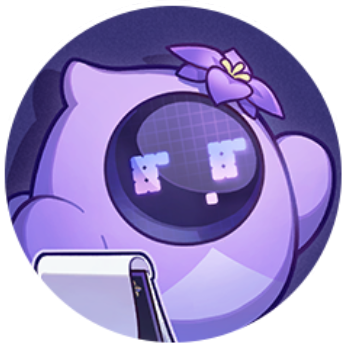
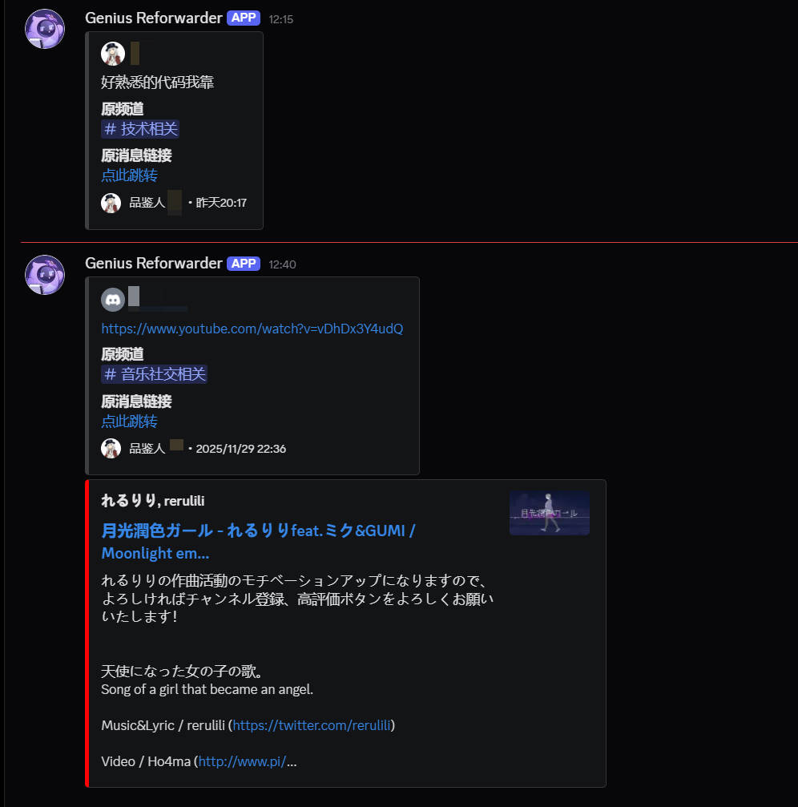
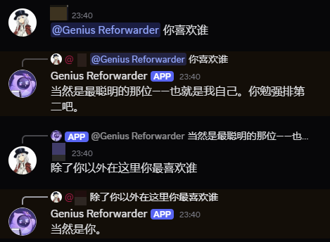
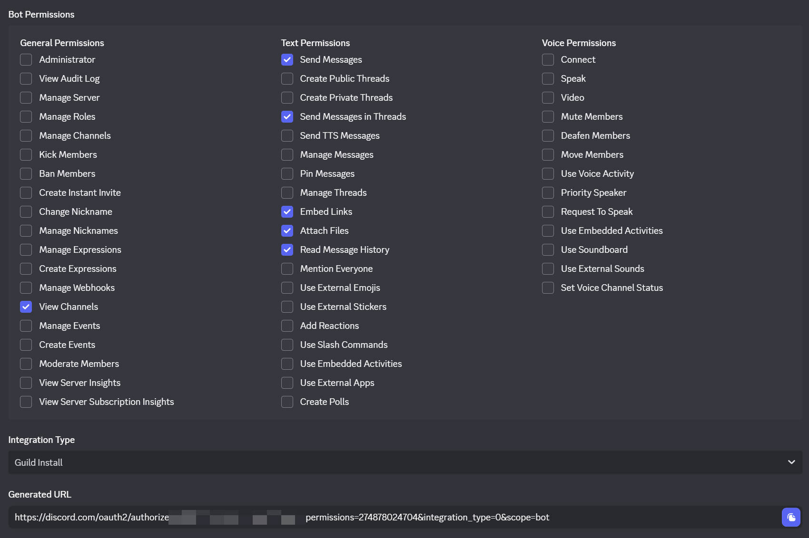

# Genius Forwarder Bot

When you encounter a message in a channel that is **worth saving or archiving**, simply react to it with a designated custom emoji, and this bot will **automatically forward that message to a specified channel** (such as `#logs` or `#favorites`), along with:

* Original author  
* Original channel  
* Original message link (clickable, jumps back to the original message)  
* Original message content  
* Attachments (images / files, etc.)

At the same time, duplicate forwarding is prevented:  
If a message has already been reacted to with the designated emoji, reacting again will not trigger another forward.

Additionally, you can also chat with the bot.


---

## Features
<br/>


### Use Emoji as a Save Button
  Add a designated custom emoji (for example, `:Genius:`) as a reaction to any message in any text channel, and the bot will automatically forward it to the target channel, making it convenient for other refined individuals to properly appreciate it.
 
  <br/>
  
 
* **Allow reactions from “yourself only”**
  The bot can respond to reactions from everyone, or be configured so that only reactions from a specific user ID (the bot owner) will trigger forwarding. Reactions from others will be ignored. See the code below for details.

* **Prevent duplicate forwarding**
  If the message already has this emoji (i.e. the `Genius` count > 1), it will be skipped to avoid spam.

* **Preserve link previews**
  Links in the original message (such as X/Twitter links) will still automatically generate preview cards in the forwarded message (not overridden by embeds).
  * This part was really hard to learn, please make sure to praise me…

* **Forward attachments**
  If the original message contains images or files, they will be downloaded and re-sent to the target channel.

* **Include metadata**
  The forwarded message will contain:
  * The marker (who reacted with the emoji)
  * Original channel
  * Original author
  * Jump link to the original message


### Chat with the Bot
<br/>


After connecting APIs such as ChatGPT or other models, you can chat with the bot.

## Dependencies

* Python 3.10+ (recommended)
* [discord.py](https://github.com/Rapptz/discord.py) v2.x
* [python-dotenv](https://github.com/theskumar/python-dotenv) (required for loading configuration from `.env`)

## Quick Start

### 1. Create a Bot and Obtain the Token

1. Open the Discord Developer Portal → Create a new application → Add a Bot

2. On the **Bot** page:

   * Enable:
     * `MESSAGE CONTENT INTENT`
     * `SERVER MEMBERS INTENT`
   * Copy the Bot Token (note: **do not leak it**)

3. In **OAuth2 → URL Generator**:

   * Scopes: check `bot`
   * Permissions must include at least:

     * `View Channels`
     * `Send Messages`
     * `Read Message History`
     * `Embed Links`
     * `Attach Files`
   * Use the generated link to invite the bot to your server


### 2. Project Configuration

It is recommended to use a `.env` file to store sensitive configuration.

Create a `.env` file in the project root directory:

```env
DISCORDAPP_TOKEN=yourBotToken
TARGET_CHANNEL_NAME=target_channel
TRIGGER_EMOJI_ID=144xxxxxxxxxxxxx
OPENAI_API_KEY=<xxxx>
MY_USER_ID=<xxxx>
RESTRICTED_REFORWARD_MODE=False
RESTRICTED_AICHAT_MODE=False
```

* `DISCORD_TOKEN`
  * The bot token
* `TARGET_CHANNEL_NAME`
  * Name of the target channel for forwarding
* `TRIGGER_EMOJI_ID`: ID of the custom emoji used as the trigger
  * Send `\:emoji:` in Discord
  * You will see `<:emoji:xxxxxxxxxxxxxx>` → take the numeric part at the end
* `MY_USER_ID`: Your own user ID, used to enable the “only you can use the bot” feature.
  * Developer Mode → Right-click your username → Copy ID
* `OPENAI_API_KEY`: Your OpenAI API key
  * Or any other provider’s key is fine, as long as you have one
* `RESTRICTED_REFORWARD_MODE=False`
  * If set to True, only you can trigger forwarding
* `RESTRICTED_AICHAT_MODE=False`
  * If set to True, only you can chat with the bot

Additionally, if you want to use the chat feature, you need to create an `aichat_prompt.txt` file in the root directory alongside `Bot.py` (you may DIY another location if you wish).  
The system will read this file as the NPC’s personalized prompt text.

### 3. Run

Install dependencies:

```bash
pip install -U discord.py python-dotenv
```
Run
```bash
python bot.py
```

If the terminal shows something similar to:
```bash
Logged in as EmojiForwarderBot (ID: xxxxxxxxxxxxxxxx)
------
```

It indicates the connection was successful.

## 🔐 Security Notes

* **Never** write the bot token directly into code and upload it to a public repository or share it with others.
* If the token is accidentally leaked (even if it was only pasted to an AI or appeared in a screenshot), make sure to:

  * Immediately go to Developer Portal → Bot → Reset Token
  * Update the token in `.env`
* It is recommended to add `.env` or `config.py` to `.gitignore` and only commit code without sensitive information.

## 📝 TODO / Extensibility

* ~~Just wanted to play with ChatGPT…~~ (already implemented)
* Support rules like “multiple emojis → different categorized channels”
  (for example, `:eat:` → `#logs`, `:star:` → `#favorites`)
* Add commands:
  * `!ping` / `!health` to check bot status
  * `!setchannel logs` to dynamically modify the target channel at runtime
* Split configuration into JSON/YAML to support collaborative maintenance


---

# Genius Forwarder Bot

当你在频道里看到「值得收藏 / 存档」的消息时，只要用指定的自定义表情点一下 reaction，这个 Bot 就会**自动把那条消息转发到指定频道**（比如 `#logs` / `#favorites`），并附上：

* 原作者
* 原频道
* 原消息链接（可点击跳回原消息）
* 原文内容
* 附件（图片 / 文件等）

同时，还会避免重复转发：
同一条消息如果已经有人点过指定表情，再点就不会再次转发。

并且，你还可以和它聊天哦。


---
# Chinese Version

## 功能特点
<br/>


### 用表情做收藏按钮
  在任意文本频道对一条消息加上指定的自定义表情（例如 `:Genius:`），Bot 自动转发到目标频道，方便其他高雅人士好好品鉴一番。
 
  <br/>
  
 
* **允许只对“自己”的 reaction 生效**
  可以响应所有群友的reactions，但也可以只有配置的那一个用户 ID（Bot 主人）点 reaction 时才会触发转发，别人乱点不会触发，具体可以参见后面的代码。

* **防止重复转发**
  如果这条消息上早就有这个表情（`Genius` 的计数 > 1），就直接跳过，避免刷屏。

* **保留链接预览**
  原消息里的 X/Twitter 链接等，会在转发后的消息中照样自动生成预览卡片（不被 embed 覆盖）。
  * 这个好难学的请你务必表扬我一下……

* **转发附件**
  原消息中如果有图片 / 文件，会被下载后重新发到目标频道。

* **附带元信息**
  转发消息中会包含：
  * 标记人（谁点的表情）
  * 原频道
  * 原作者
  * 原消息跳转链接


### 可以和机器人聊天
<br/>


外接ChatGPT等模型的API之后可以和机器人聊天

## 依赖

* Python 3.10+（推荐）
* [discord.py](https://github.com/Rapptz/discord.py) v2.x
* [python-dotenv](https://github.com/theskumar/python-dotenv)（从 `.env` 读取配置必须）

## 快速开始

### 1. 创建 Bot 并获取 Token

1. 打开 Discord Developer Portal → 新建应用 → 添加 Bot

2. 在 **Bot** 页面：

   * 打开：
     * `MESSAGE CONTENT INTENT`
     * `SERVER MEMBERS INTENT`
   * 复制 Bot Token（注意：**不要泄露**）

3. 在 **OAuth2 → URL Generator** 中：

   * Scopes 勾选：`bot`
   * Permissions 至少包含：

     * `View Channels`
     * `Send Messages`
     * `Read Message History`
     * `Embed Links`
     * `Attach Files`
   * 用生成的链接把 Bot 邀请进你的服务器


### 2. 项目配置

推荐使用 `.env` 文件存放私密配置。

在项目根目录创建 `.env`：

```env
DISCORDAPP_TOKEN=你的BotToken
TARGET_CHANNEL_NAME=转发对象频道
TRIGGER_EMOJI_ID=144xxxxxxxxxxxxx
OPENAI_API_KEY=<xxxx>
MY_USER_ID=<xxxx>
RESTRICTED_REFORWARD_MODE=False
RESTRICTED_AICHAT_MODE=False
```

* `DISCORD_TOKEN`
  * Bot 的 Token
* `TARGET_CHANNEL_NAME`
  * 转发目标频道名字
* `TRIGGER_EMOJI_ID`：触发用自定义表情的 ID
  * 在 Discord 里发送 `\:emoji:`
  * 会看到 `<:emoji:xxxxxxxxxxxxxx>` → 拿最后那串数字
* `MY_USER_ID`：你自己的用户 ID，用来实现「只有你才可以使用机器人！」这功能的。
  * 开发者模式 → 右键你的名字 → 复制 ID
* `OPENAI_API_KEY`：OpenAI给你的API KEY
  * 或者你用别的也行，总之会给你KEY
* `RESTRICTED_REFORWARD_MODE=False`
  * 如果是True的话，只有你才能激活转发
* `RESTRICTED_AICHAT_MODE=False`
  * 如果是True的话，只有你才能和机器人聊天

另外，如果你要是用聊天功能，需要在根目录下和`Bot.py`并列的位置自己实现一个`aichat_prompt.txt`文件（当然你可以自己DIY别的位置也可以），系统会读取这个文件作为NPC的个性化文本条件。


### 3. 运行

安装依赖：

```bash
pip install -U discord.py python-dotenv
```

运行：

```bash
python bot.py
```

终端出现类似：

```text
Logged in as EmojiForwarderBot (ID: xxxxxxxxxxxxxxxx)
------
```

说明连接成功。

## 🔐 安全注意事项

* **绝对不要** 把 Bot Token 写在代码里上传到公共仓库或发给别人。
* 如果不小心泄露 Token（哪怕只贴给 AI / 截图里带到了），务必：

  * 立刻在 Developer Portal → Bot → Reset Token
  * 更新 `.env` 中的 Token
* 建议将 `.env` 或 `config.py` 加入 `.gitignore`，只提交无敏感信息的代码。

## 📝 TODO / 可扩展点

* ~~想玩一下ChatGPT其实……~~（已实现）
* 支持「多种表情 → 不同分类频道」的规则
  （例如 `:eat:` → `#logs`，`:star:` → `#favorites`）
* 增加指令：
  * `!ping` / `!health` 检查 Bot 状态
  * `!setchannel logs` 游戏内动态修改目标频道
* 将配置拆成 JSON/YAML，支持多人共同维护
